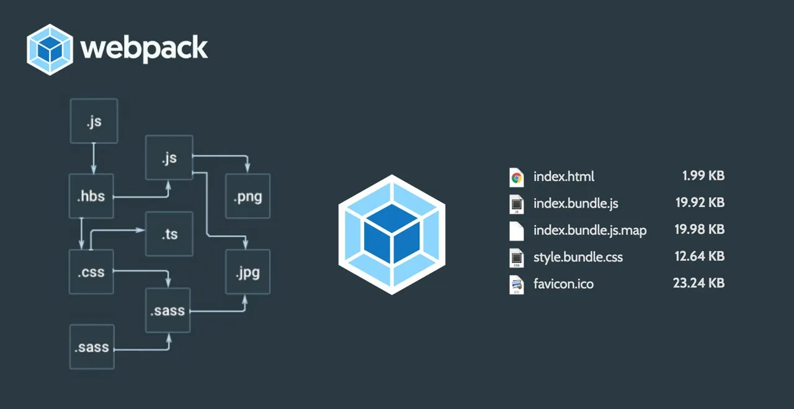

# Webpack master

### This repository presents an example of using Webpack, including:

- Setting up a basic Webpack configuration
- Using different **Loaders** and **Plugins**
- Webpack **DevServer** settings
- Using the **Webpack Bundle Analyzer**

### Webpack

Webpack is a build tool for web development that enables bundling various files of your project (such as JavaScript, CSS, images) into one or more bundles for optimized web application loading.

**List of problems that Webpack solves:**
- **Modularity:** Webpack allows you to organize code into modules, making it easier to maintain and develop.
- **Dependency Management:** Webpack automatically manages dependencies between JavaScript, CSS, images, and other resources.
- **Code Compression and Optimization:** Webpack allows you to merge and minimize files to reduce the size of downloaded resources and improve site performance.
- **Handling Different File Types:** Webpack allows you to import and use different file types such as CSS, JSON, SVG and others as JavaScript modules.
- **File Hashing:** Webpack automatically appends hashes to file names, which solves the problem of caching and updating files on the client side.
- **Code splitting:** Webpack allows you to split your application into smaller chunks (chunks) that are loaded as needed, improving loading speed and caching efficiency.
- **Hot Module Replacement (HMR):** Webpack allows you to update only changed modules during development without reloading the entire page, which speeds up the development process.
- **Integration with Various Tools:** Webpack integrates with various development tools such as Babel, ESLint, TypeScript and many others, providing flexibility and extensibility.

### The role of Webpack in the create-react-app template

In the create-react-app template, Webpack is preconfigured, allowing developers to focus on writing code without spending time setting up Webpack configurations.

Some basic Webpack features in create-react-app include:
- Modular System
- File Hashing
- Resource Optimization
- Dev server with automatic reboot

### Summary

Webpack in create-react-app provides developers with a powerful tool for building and optimizing React applications. It reduces the time spent on setting up the project infrastructure, allowing you to focus on developing the application functionality. Using create-react-app with a pre-configured Webpack greatly speeds up the development process and simplifies project support.
